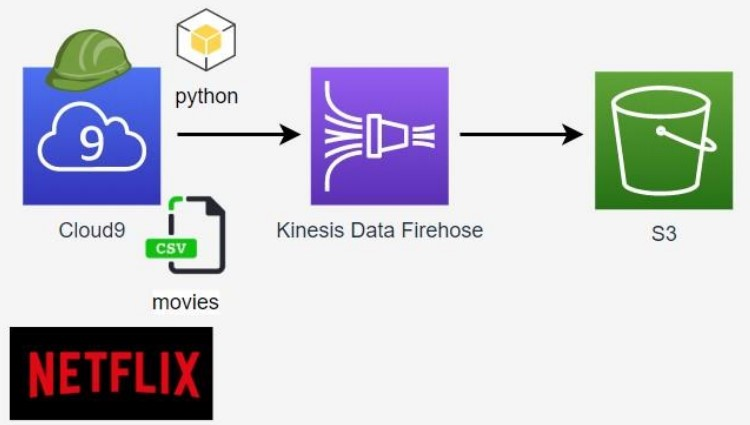
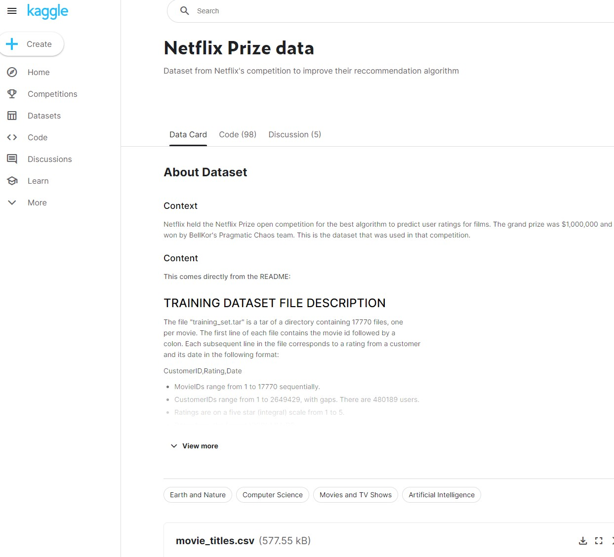
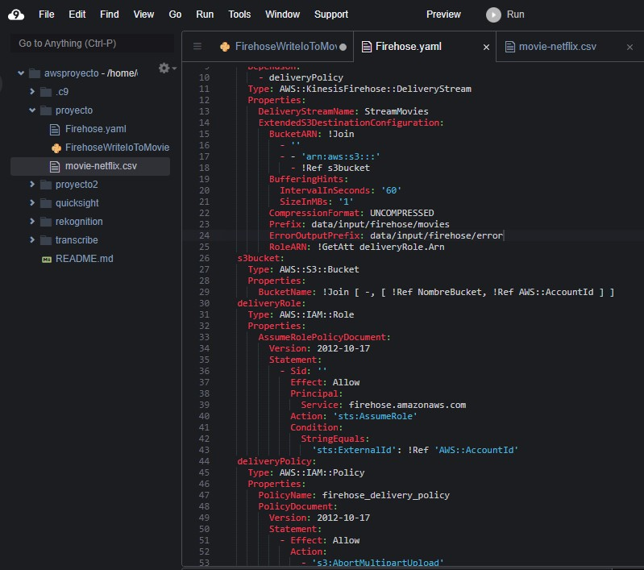
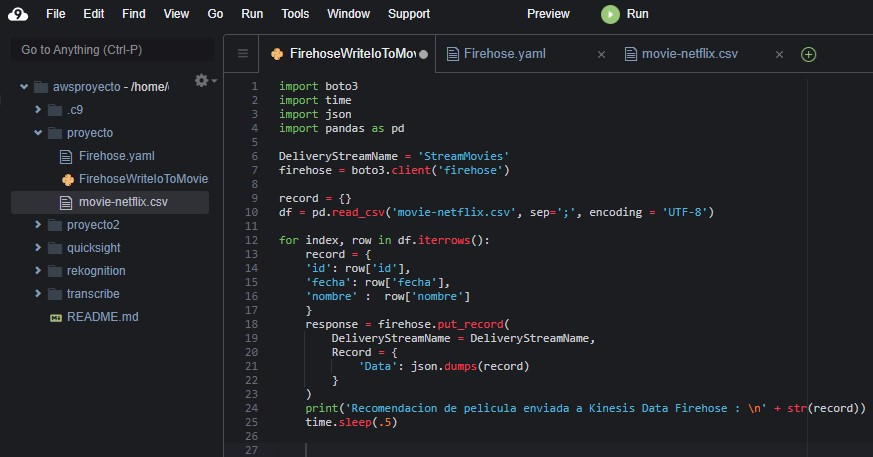
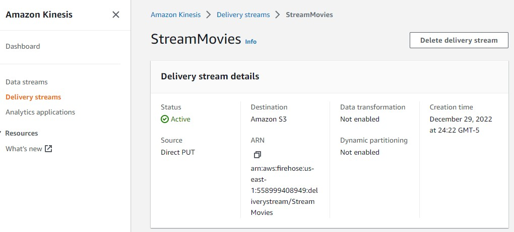
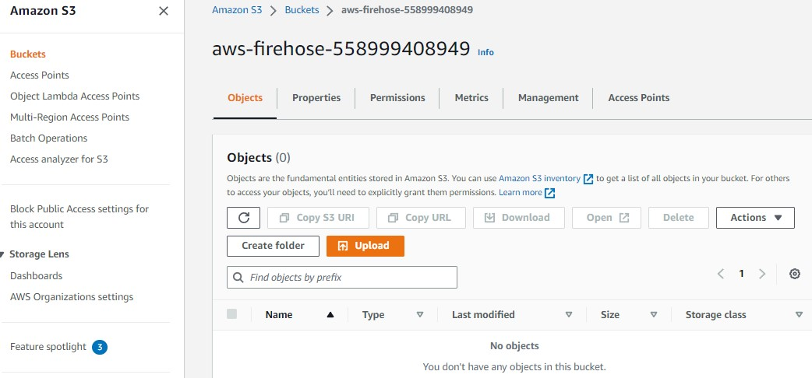
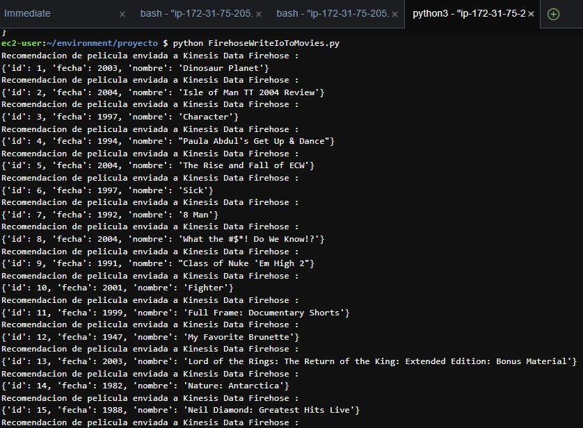
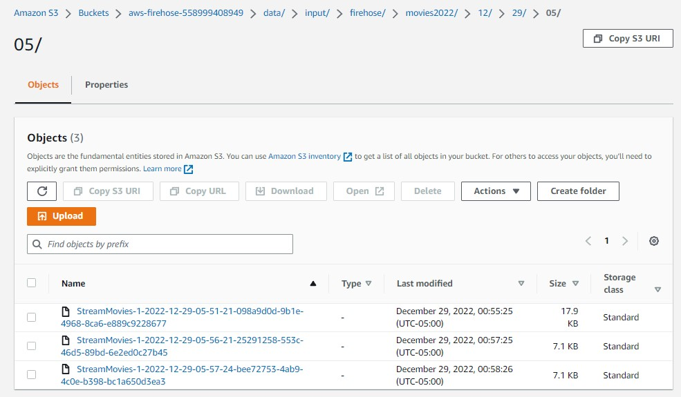

# AWS-Kinesis-Data-FireHose-Project

Projecto de Kinesis Data FireHose
En este proyecto se procedera a crear un script en Python que permita leer un archivo .csv sobre informacion de Netflix obtenido de Kaggle, enviando todos los registros leidos fila por fila a un stream de Kinesis Data Firehose, para posteriormente almacenarse en un bucket de S3.
Realizando un proceso de extraccion de datos de una fuente externa mediante Kinesis Data Firehose para almacenarla en un Datalake que seria S3

# Arquitectura realizada

# Procedimiento

# Repositorio Kaggle de Netflix
- Se ha descargado un archivo movies-netflix.csv del repositorio Kaggle para obtener informacion real sobre las peliculas que estan en tendencia en Netflix.

# Instancia de Cloud9
- Se tiene una instancia de Cloud9 para poder ejecutar los scripts creados 

- Se ha creado una plantilla en formato .yaml usando CloudFormation para la creacion y despliegue de los recursos mencionados un Stream en Kinesis Data Firehose que envie los datos en tiempo real al bucket de S3

- Se ha creado un script en python para la lectura del archivo movies-netflix.csv

# Ejecucion
- Comando para ejecutar la plantilla: aws cloudformation create-stack --stack-name StackProyectoFirehose --template-body file://Firehose.yaml --capabilities CAPABILITY_NAMED_IAM

- Stream de Kinesis Data Firehose

- Bucket S3

- Una vez desplegado el Stream de Kinesis Data Firehose y el bucket de S3, se procede a ejecutar el script de python, se esta empleando la libreria pandas para hacer la lectura del archivo .csv, con el metodo firehose.put_record se procede a hacer conectarlo con Kinesis Data Firehose para que el stream  creado lea el archivo estableciendo un bucle for para iterar la lectura fila por fila cada 500 milisegundos, simulando la ingesta en tiempo real.

- Los datos del dataframe se imprimen en la consola y se envian al bucket S3.

- Metricas del Stream de Kinesis

- Se observan los archivos en el bucket S3, estableciendo el flujo de datos haciendo la lectura fila por fila desde el Stream de Kinesis para almacenarlo en el bucket S3.

